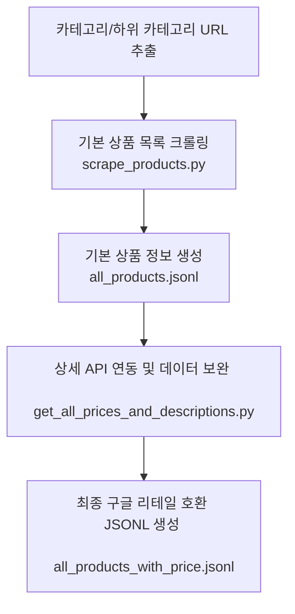

# Shiseido Online Store Catalog Scraper & Converter

이 프로젝트는 시세이도 온라인 스토어(Shiseido Online Store)의 다양한 카테고리 상품 목록을 수집(Crawling)하고, 구글 클라우드의 **AI Commerce Search (Google Cloud Retail Catalog)**의 BigQuery 스키마 규격에 맞춰 JSONL 형식으로 변환 및 정제하는 도구 모음입니다.

---

## 1. 데이터 파이프라인 개요

시세이도 온라인 스토어 상품 데이터를 구글 리테일 스키마에 맞춰 통합하는 작업은 다음과 같은 순서로 이루어집니다.



---

## 2. 주요 핵심 기술 사양 (API 및 데이터 매핑)

### 2.1 시세이도 내부 상세 정보 API
상세 상품 가격(세금 포함) 및 전체 설명 데이터는 웹 페이지의 자바스크립트가 로딩될 때 호출되는 내부 API 엔드포인트를 사용해 취득합니다.
* **API Endpoint**: `https://www.shiseido.co.jp/sw/api/auth/V1/SWFR070220.seam`
* **Query Parameter**: `shohin_pl_c_cd={PRODUCT_ID}` (예: `E65401`, `H97001` 등 상품 ID)
* **특징**: 자사몰 세션 쿠키가 없이 공용 헤더로도 빠른 속도로 정상 응답을 리턴하며, 상품 정보 검색에 실패하지 않고 정확한 원본 데이터를 제공합니다.

### 2.2 구글 리테일 Catalog 스키마 매핑 정의
API 응답 필드를 다음 기준에 맞추어 CamelCase 규격으로 매핑했습니다.

| 구글 리테일 필드명 | 설명 | 소스 데이터 필드 및 처리 |
| :--- | :--- | :--- |
| `id` | 상품의 고유 코드 | URI에서 추출한 제품 ID (예: `E65401`) |
| `title` | 상품명 | API 응답 `shohin_name` 사용 |
| `brands` | 브랜드 배열 | API 응답 `brnd_mei` 사용 |
| `categories` | 대분류-소분류 카테고리 구조 | 수집된 카테고리 구조 매핑 적용 |
| `uri` | 상품 상세 페이지 URL | `https://www.shiseido.co.jp/sw/onlinestore/products/{id}.html` |
| `images` | 이미지 CDN URL | `shohin_pl_c_gz_list` 내부의 `shohin_pl_c_gz_mb_fl_pth` 상대 경로 앞에 `https://imagecdn.shiseido.co.jp/c!/a=0,f=webp:jpg/resources/sw`를 붙여 생성 |
| `priceInfo` | 세금 포함 가격 정보 | API 응답 `komi_kkk` 값을 실수형(`float`)으로 변환하여 `currencyCode: JPY`, `price`, `originalPrice`에 일치화 |
| `description` | 줄바꿈 정제된 상세 설명 | API 응답 `body_copy_joho` 내의 `<br />` 태그를 `\n`으로 대체한 뒤 기타 HTML 태그를 BeautifulSoup으로 완벽히 정제하여 텍스트 데이터로 치환 |
| `attributes` | 상세 부가 정보 리스트 | BigQuery Repeated Record 규격에 맞춰 `[{"key": "volume", "value": {"text": ["120mL"]}}]`와 같이 key-value 구조 배열로 생성 |

---

## 3. 스크립트 실행 방법

### 3.1 사전 요구사항
필요한 패키지를 설치합니다.
```bash
pip install requests beautifulsoup4 urllib3
```

### 3.2 상세 정보 취득 및 구글 리테일 데이터 변환 실행 (온라인 크롤링)
이미 수집된 `all_products.jsonl` 파일을 원본으로 삼아, 시세이도 API를 호출하여 가격 및 정제된 설명을 추가한 최종 호환 데이터 `all_products_with_price.jsonl`을 생성합니다.
```bash
python3 get_all_prices_and_descriptions.py
```
* **동작 시간**: 1,115개 상품 기준 약 3분 소요 (기본 대기 시간 포함).
* **주의**: 외부 API를 연속적으로 호출하므로, **새로운 상품을 신규로 가져오는 경우**에만 실행해 주세요.

### 3.3 로컬 오프라인 데이터 포맷 변환 (오프라인 변환)
만약 가격 및 상세 정보가 이미 수집되어 `all_products_with_price.jsonl` 파일이 존재하고, 단순히 스키마 에러 해결이나 특정 필드 포맷(예: `attributes`를 Repeated Record 리스트형으로 수정)만 변경해야 하는 경우에는 **시세이도 서버 API에 재접속하지 않고 로컬에서 오프라인으로 안전하게 포맷팅을 수행**합니다.
```bash
python3 format_attributes_offline.py
```
* **동작 시간**: 1,115개 상품 기준 0.1초 이내 완료.
* **장점**: 시세이도 서버에 트래픽을 주지 않고 공격으로 오인당할 위험을 방지합니다.

---

## 4. 향후 작업 수행을 위한 AI 가이드 프롬프트

추후 새로운 상품 카테고리를 추가하거나 데이터셋을 처음부터 재구축해야 할 경우, AI 어시스턴트에게 다음 프롬프트를 전달하면 동일한 방식으로 자동 처리가 가능합니다.

### 📋 AI Assistant 실행용 프롬프트 템플릿
```text
시세이도 온라인 스토어(shiseido.co.jp)의 상품 데이터를 크롤링하고 Google Retail Catalog 규격의 JSONL 데이터로 변환해 주세요.

[요구사항 및 처리 규칙]
1. 상품 상세 정보(정확한 가격 및 상세 탭 설명)는 원본 HTML 크롤링이 아닌, 시세이도 전용 내부 API를 호출해 취득해야 합니다.
   - Endpoint: https://www.shiseido.co.jp/sw/api/auth/V1/SWFR070220.seam
   - Params: shohin_pl_c_cd={product_id}
   
2. 수집된 JSON 객체 구조는 Google Retail Catalog의 BigQuery 스키마에 부합해야 합니다.
   - 반드시 카멜케이스(camelCase) 키를 사용해 주세요. (예: price_info가 아닌 priceInfo, original_price가 아닌 originalPrice)
   
3. 데이터 파싱 세부 사양:
   - 가격(priceInfo): API 응답의 'komi_kkk' 값을 숫자로 변환하여 'price'와 'originalPrice'에 매핑합니다. (화폐 단위: 'JPY')
   - 상세 설명(description): API 응답의 'body_copy_joho' 값을 정제합니다. <br /> 태그는 개행 문자('\n')로 치환하고, 다른 HTML 태그들은 모두 파싱하여 순수 텍스트만 추출해 입력해 주세요.
   - 상품 속성(attributes): API 응답 내 'hyoji_yo_naiyo_ryo'(용량), 'type_zaikei_mei'(제형), 'yakuji_kbn_mei'(의약외품 여부), 'gensan_koku'(제조국) 데이터를 취합하여 BigQuery Repeated Record 규격인 `[{"key": "속성키", "value": {"text": ["값"]}}]` 형태의 배열 구조로 만들어 'attributes'에 삽입해 주세요. (예: [{"key": "volume", "value": {"text": [volume]}}])
   - 이미지(images): 'shohin_pl_c_gz_list' 배열 내 모바일 규격 경로인 'shohin_pl_c_gz_mb_fl_pth' 값을 취득한 뒤, 아래 CDN 주소를 앞에 결합하여 최종 이미지 주소를 생성해 주세요:
     https://imagecdn.shiseido.co.jp/c!/a=0,f=webp:jpg/resources/sw{relative_path}

4. get_all_prices_and_descriptions.py의 로직을 참조하여, 안정적인 속도 제한(rate limit sleep)과 오류 예외 처리가 들어간 스크립트를 가동해 최종 데이터를 jsonl 형식으로 완성해 주세요.
```
