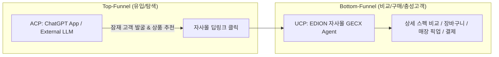
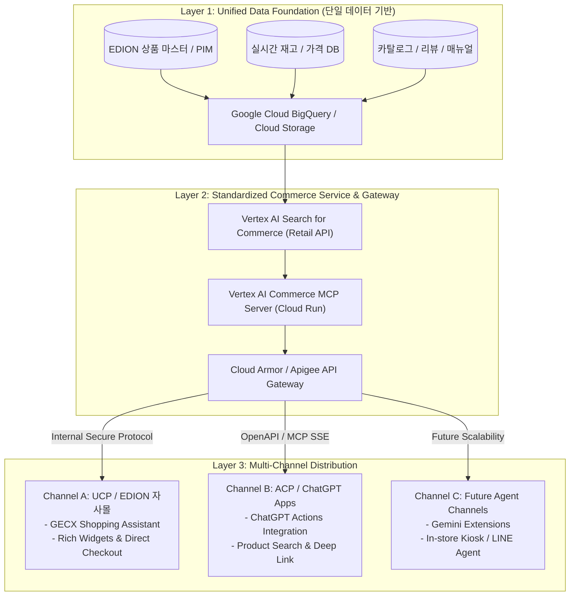

# [전략 분석 및 아키텍처 제안서] EDION UCP & ACP(App in ChatGPT) 통합 대응 전략

---

## 1. 개요 및 배경 분석 (Executive Summary & Context)

### 1.1 배경 및 상황
* **고객사**: EDION (일본 대형 가전/전자제품 양판점)
* **경쟁/시장 상황**: 사이버에이전트(CyberAgent)가 EDION 측에 **ACP (App in ChatGPT / OpenAI 커머스 연동)** 관련 제안을 진행함에 따라, EDION 측에서 당사에 *"ACP 대응 방식에 대해서도 알려달라"*는 요청을 전달함.
* **핵심 질문 및 고민**:
  1. 다음 주 EDION 미팅에서 기존 **UCP(Unified Commerce Platform / GECX 자사몰 에이전트)**뿐만 아니라 **ACP(App in ChatGPT) 연계**까지 아키텍처에 포함 가능한가?
  2. Google Cloud 기반 데이터 파이프라인(SSOT)을 구축하고, 거기서 UCP와 ACP로 데이터를 각각 공급하는 구조가 타당한가?

### 1.2 핵심 결론 (Bottom Line)
* **결론**: **100% 가능하며, 전략적으로 매우 강력히 권장되는 방향**입니다.
* **전략적 포지셔닝**: 사이버에이전트의 제안에 방어적으로 대응하는 것이 아니라, **"Google Cloud의 단일 데이터 기반(Data Foundation) 및 MCP/API Gateway가 UCP(자사몰)와 ACP(ChatGPT)를 모두 포용하는 상위 호환 아키텍처"**임을 입증하여 프로젝트의 스케일과 주도권을 확보할 수 있습니다.

---

## 2. UCP vs ACP 상세 비교 및 역할 정의



| 비교 항목 | **UCP (Unified Commerce / GECX)** | **ACP (App in ChatGPT / OpenAI 연동)** |
| :--- | :--- | :--- |
| **채널 성격** | **자사 Direct 채널** (공식 웹사이트, 모바일 앱, 매장 키오스크) | **외부 Open LLM 채널** (OpenAI ChatGPT 생태계) |
| **퍼널 상 역할** | **Bottom-Funnel**: 상세 비교, 장바구니 담기, 결제, 매장 재고 확인, 회원 혜택 | **Top-Funnel**: 브랜드 인지도 제고, 외부 대화형 검색 유입, 초기 제품 탐색 |
| **UI/UX 통제권** | **100% 통제 가능** (풍부한 커스텀 위젯, 인터랙티브 비교표, 자사 브랜딩) | **제한적** (ChatGPT 텍스트 및 기본 마크다운/간이 렌더링에 종속) |
| **보안 및 고객 데이터** | 세션 컨텍스트, 고객 구매 이력, 장바구니 데이터 안전하게 보호 | 외부 플랫폼이므로 최소한의 공개 상품 정보만 노출 필요 |
| **기술적 구현체** | Google Vertex AI Agent Builder, Retail API, GECX Client | OpenAPI Actions / Model Context Protocol (MCP) Gateway |

---

## 3. 통합 아키텍처 청사진 (Integrated 3-Tier Architecture)

본 프로젝트에 기구축된 `Vertex AI Commerce MCP Server` 및 `Vertex AI Search for Retail API`를 핵심 서비스 계층으로 활용하는 이상적인 3계층 아키텍처입니다.



### 계층별 기술 구성 요소

#### 1) Layer 1: Unified Data Foundation (Google Cloud)
* **역할**: 상품 정보의 단일 진실 공급원(Single Source of Truth, SSOT).
* **구성**:
  * **정형 데이터**: 상품 마스터, 카테고리 계층, 실시간 가격 및 지점별 재고.
  * **비정형 데이터**: 상품 설명서, 리뷰, 카탈로그 PDF, Q&A 데이터.
* **핵심 가치**: 데이터 사일로(Silo)를 방지하여 자사몰과 ChatGPT 간의 가격/재고 불일치를 원천 차단.

#### 2) Layer 2: Standardized Commerce API / MCP Gateway (Cloud Run)
* **역할**: 복잡한 커머스 검색 로직을 표준 인터페이스로 추상화하고 보안 및 속도 제어.
* **구성**:
  * **`search_products`**: 자연어 기반 다면 검색 및 필터링.
  * **`get_product_details`**: 상품 상세 스펙, 이미지 URI, 자사몰 딥링크 URI 반환.
  * **`predict_recommendations`**: Vertex AI 기반 추천(유사 상품, 함께 구매하면 좋은 상품).
* **보안/거버넌스**: Apigee / Cloud Armor를 통해 ChatGPT 측의 과도한 스크래핑/트래픽을 제어(Rate Limiting)하고 API 키 인증 관리.

#### 3) Layer 3: Multi-Channel Distribution (UCP & ACP)
* **UCP (자사몰 GECX)**:
  * 사용자에게 `product_list`, `comparison_table` 등 리치 위젯을 인터랙티브하게 노출하고 즉시 구매 전환.
* **ACP (ChatGPT App / Action)**:
  * ChatGPT에서 OpenAPI 명세서를 통해 EDION MCP Server를 호출.
  * 검색된 상품 요약과 함께 반드시 **"EDION 공식몰에서 상세 확인 및 구매하기" 딥링크(`uri`)**를 첨부하여 자사몰 유입 유도.

---

## 4. 사이버에이전트(CA) 제안 대비 차별화 및 경쟁 우위 전략

차주 EDION 미팅 시 아래 4가지 논리로 고객을 설득합니다.

```
[차별화 피칭 프레임워크]
"ChatGPT 연동(ACP)은 채널 중 하나일 뿐이며, 핵심 승부처는 '통합 데이터 인프라'입니다.
Google Cloud 기반의 공통 데이터 파이프라인을 구축하면 ACP는 물론 자사몰 UCP, 나아가 미래의 모든 AI 채널을 동시에 장악할 수 있습니다."
```

### ① 데이터 사일로(Silo) 및 이중 투자 방지
* **문제점**: ChatGPT 연동(ACP)만을 위해 별도 DB나 임시 파이프라인을 만들면, 자사몰 시스템과의 데이터 불일치(품절 상품 노출, 가격 오표기)가 발생하고 운영 비용이 2배로 증가함.
* **해결책**: Google Cloud 기반의 SSOT를 구축하여 단 한 번의 데이터 연동으로 UCP와 ACP를 동시 지원.

### ② 보안 및 엔터프라이즈 거버넌스 확보
* **문제점**: 외부 플랫폼(OpenAI)에 자사 핵심 데이터베이스를 직접 오픈하는 것은 보안상 위험.
* **해결책**: Cloud Run 상의 MCP / API Gateway가 안전한 샌드박스 역할을 수행하여, 인가된 정제 데이터만 안전하게 ChatGPT로 공급.

### ③ 완결성 있는 옴니채널 풀퍼널(Full-Funnel) 고객 경험
* ChatGPT(ACP)에서 유입된 고객이 딥링크를 타고 자사몰로 들어왔을 때, 자사몰 AI 에이전트(GECX)가 이전 탐색 맥락을 이어받아 매장 재고 조회, 포인트 적립, 당일 배송 안내까지 원스톱으로 구매 전환.

### ④ 미래 확장성 (Vendor Lock-in 탈피)
* OpenAI 전용 스펙으로만 개발할 경우 플랫폼 종속성 발생.
* MCP(Model Context Protocol) 및 OpenAPI 표준 기반으로 구축하면, 향후 Google Gemini, Apple Intelligence, Anthropic Claude 등 어떤 플랫폼이 대세가 되어도 추가 개발 없이 100% 즉시 대응 가능.

---

## 5. 단계별 추진 로드맵 (Phased Implementation Roadmap)

```
[Phase 1] Core Data Foundation & UCP (자사몰 우선 완성)
  ├── 1-1. BigQuery & Vertex AI Search for Commerce 카탈로그 파이프라인 구축
  ├── 1-2. Cloud Run 기반 Vertex AI Commerce MCP Server 배포 및 검증
  └── 1-3. EDION 자사몰 GECX AI Agent 연동 (검색, 비교, 추천 위젯 완결)

[Phase 2] ACP & Multi-Channel Expansion (ChatGPT 및 외부 채널 확장)
  ├── 2-1. OpenAPI 3.0 명세서 작성 및 ChatGPT Custom Actions / Apps 등록
  ├── 2-2. 트래픽 제어 및 자사몰 구매 딥링크(Deep Link) 트래킹 체계 구축
  └── 2-3. ChatGPT 유입 고객의 UCP 연계 시나리오(장바구니 연결 등) 최적화
```

---

## 6. [부록] EDION 미팅용 일본어 제안 스크립트 & 팀 공유 템플릿

### 6.1 사내/팀 슬랙 회신 템플릿 (Japanese)

```markdown
お疲れ様です！共有ありがとうございます。

ご相談いただいた件、**「UCP対応だけでなく、ACP（App in ChatGPT）連携も視野に入れたアーキテクチャ提案」を次回MTGに盛り込むことは技術的にも戦略的にも非常に有効かつ推奨**されます。

おっしゃる通り、本質は**「強固なデータ基盤（商品・在庫・価格のSSOT）をGoogle Cloud上に構築し、そこからUCP（自社EC/GECX）およびACP（ChatGPT等の外部LLM）の双方へAPI経由でデータを供給するマルチチャネル構成」**となります。

次回MTGでは、以下のポイントを軸にアーキテクチャのアップデートを提示するのが効果的と考えます：

1. **データ基盤の共通化（Silo化の防止）**
   - ACP専用、UCP専用で個別開発するのではなく、単一のデータ基盤＋標準API Gateway（OpenAPI/MCP等）を構築することで、二重投資と在庫・価格の不一致を防止。
2. **UCPとACPの役割分担（フルファネルの顧客体験）**
   - **ACP（ChatGPT等）**: 外部からの新規流入・初期探索（Top-Funnel）
   - **UCP（自社EC/GECX）**: 詳細比較・決済・会員連携・購入完了（Bottom-Funnel）
3. **将来の拡張性**
   - このアーキテクチャであれば、ChatGPT（ACP）だけでなく、今後のGeminiやその他AIエージェントの台頭時にも即座に対応可能。

次回資料のアーキテクチャ図に「Unified Data Foundation → API Gateway → UCP & ACP」のレイヤー構造を反映し、サイバーエージェントさんの提案を包含・昇華させた提案として提示しましょう！
```

### 6.2 EDION 고객 미팅 발표 시 핵심 멘트 (Talking Points for Meeting)

> **「EDION様が検討されているChatGPT連携（ACP）は、新規ユーザーの接点拡大において非常に重要です。  
> ただし、ChatGPT専用に別個の仕組みを作るのではなく、Google Cloud上に構築する『統合商品データ基盤』から、自社ECのAIエージェント（UCP）と外部ChatGPT（ACP）の双方へ安全かつリアルタイムにデータ連携するアーキテクチャをご提案いたします。  
> これにより、データの二重管理や価格・在庫の不一致を防ぎつつ、ChatGPTで商品を認知したお客様をシームレスにEDION公式ECでの購入へと誘導するフルファネルの体験が実現できます。」**

---
*문서 작성일: 2026-08-14*  
*작성 환경: EDION GECX AI Agent Project Repository*
